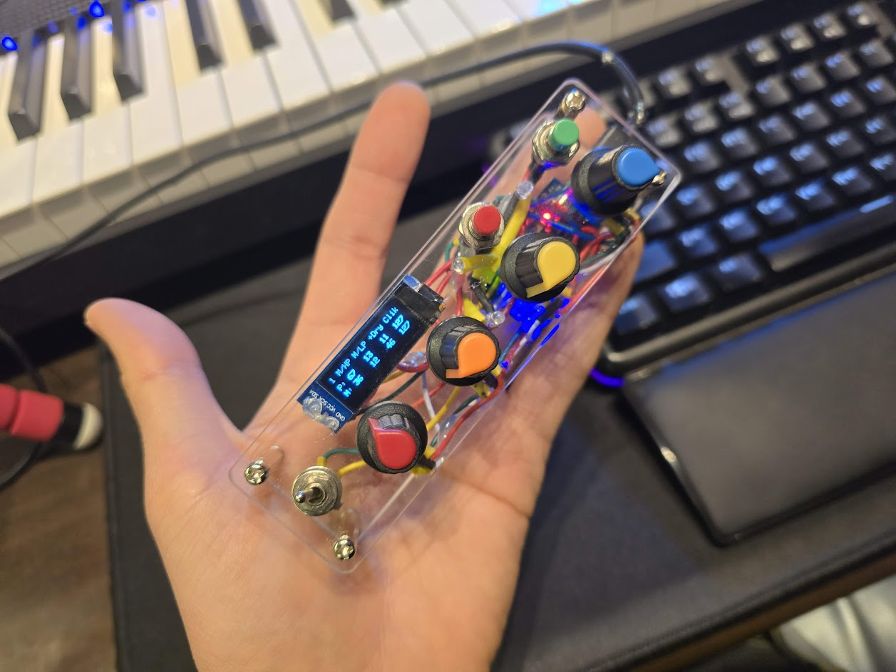

I'm not a programmer, but I built this with help from AI. I'm sharing this in the hopes that it might be helpful to someone.  
  
It has two pages for four pots. It can be assigned a total of eight CC numbers and includes two push switches that can be used as momentary toggles.  
The current pot values ​​are displayed on the display and synchronized with page changes.  
You can receive MIDI values ​​from your DAW, and the display will display those values.  
  
Required components:  
Arduino Pro Micro (ATmega32U4)  
I2C SSD1306 OLED display  
B10K potentiometer  
LED and resistor  
2-pin SPST push switch (momentary)  
3-pin or more toggle switch (on-on)  
  
[Soldering]  
const int potPins[4] = {A0, A1, A2, A3}; // Pot pins (4)  
const int switchPins[] = {8, 4, 6}; // Switch pins: Preset toggle switch, push switch 1, push switch 2  
const int ledPins[] = {9, 5, 7}; // LED pins: Pot-linked LED, sw1 LED, sw2 LED  
*Display soldered to I2S  

[Adjust push switch modes]  
bool toggleModes[] = {true, false}; // Toggle modes (switch 1: toggle, switch 2: momentary)  
  
[Set 8 values ​​for 4 pots]  
const byte ccNumbers[8] = {12, 84, 91, 88, 30, 31, 32, 33}; CC number for each pot  
const byte channels[8] = {6, 6, 0, 12, 4, 4, 4, 4}; CC channel for each pot. This should be -1 (0 for channel 1).  
const char* potNames[8] = {"PICH", "GAIN", "CLIK", "+DRY", "CUT", "ENV", "OSC", "AIR"}; 4-letter names to be displayed on the display.  
  
https://www.instagram.com/p/DFeroCWTARv/?img_index=2  
  
##   

If you're using multiple Arduinos of the same model, you'll need to use different hardware codes.  

Example:  
C:\Users\Administrator\AppData\Local\Arduino15\packages\arduino\hardware\avr\1.8.6  
  
board txt  
micro.build.mcu=atmega32u4  
micro.build.f_cpu=16000000L  
micro.build.vid=0x2341  
micro.build.pid=0x8038 <- (correction)  
micro.build.usb_product="ASW_MC-422s"  
micro.build.board=AVR_MICRO  
micro.build.core=arduino  
micro.build.variant=micro  
micro.build.extra_flags={build.usb_flags}  
  
C:\Users\Administrator\AppData\Local\Arduino15\packages\arduino\hardware\avr\1.8.6\cores\arduino  
  
USBDesc.h  
#define USB_PRODUCT_NAME "ASW_MC-422s"  
#define USB_DEVICE_SERIAL "ASW001"  
  
usbcore.cpp  
#define USB_MANUFACTURER "Ash Sound Works"  
#define USB_PRODUCT "ASW_MC-422s"  
